# Kuro Screensaver

> A retro-CRT 3D screensaver: six seeded procedural scenes, a full synthetic
> CRT signal-degradation pass, a self-typing operator-under-attack terminal, and
> a procedural audio layer. Runs as a **native macOS screensaver** (live-rendered
> in Metal), a **real Windows `.scr`**, and in **any browser**.

[](LICENSE)
[](native/macos)
[](native/macos)
[](https://threejs.org)
[](native/windows)

<p align="center">
  <a href="https://codeberg.org/jkaindl/kuro-screensaver/releases/latest">
    
  </a>
  &nbsp;
  <a href="https://jkaindl.codeberg.page/kuro-screensaver/">
    
  </a>
</p>

<p align="center">
  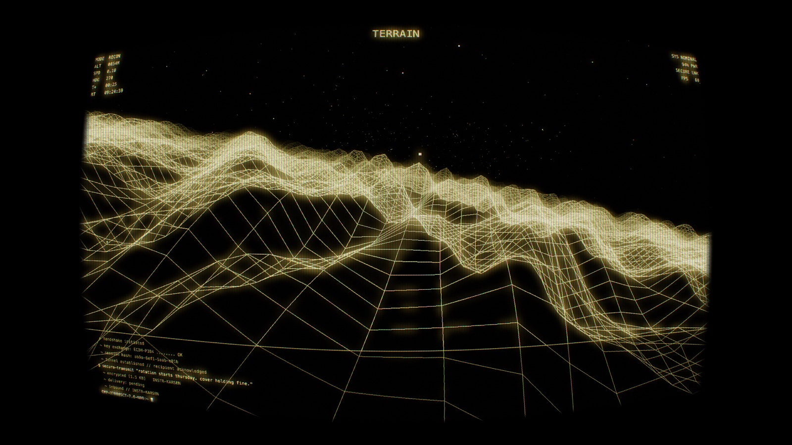
</p>

Started life as a browser engine (extracted from the `kuro-companion` Obsidian
plugin). **The headline is a full native rewrite in Metal** — a real, live-rendered
macOS screensaver: no WebView, no pre-rendered video, the whole engine running on
the GPU. The web build lives on for in-browser play and cross-platform packaging.

**New in v0.6.0 — the world reacts to the story.** As the operator's shift escalates
(`ROUTINE → INTRUSION → ALARM → PANIC`), the 3D world tightens with it: the fog closes
in, the CRT degrades, the camera hesitates when something is noticed, a storm builds,
and an "enemy" colour bleeds into the geometry — a subtle build that pays off near
PANIC and is released by the crash. On web + native.

Earlier (v0.4.x): web↔native feature parity — analog-CRT pass, dynamic banking flight,
one-click Looks, a cinematic 5-layer matrix rain (also a selectable **MATRIX** scene),
plus a native flat-HUD toggle and richer preset colours.

---

## Gallery

Six seeded procedural scenes, each recolorable by any of 13 phosphor presets:

<table>
  <tr>
    <td width="50%">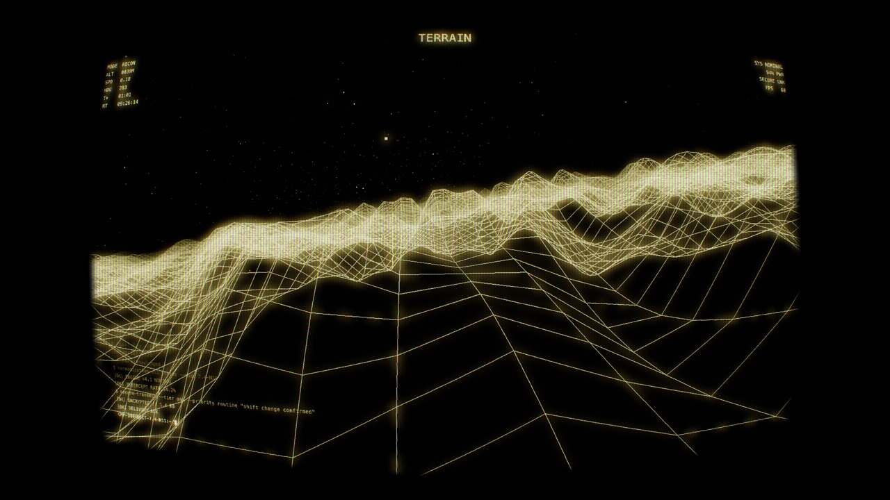<br><sub><b>TERRAIN</b> — seam-free infinite wireframe landscape, banking flythrough</sub></td>
    <td width="50%">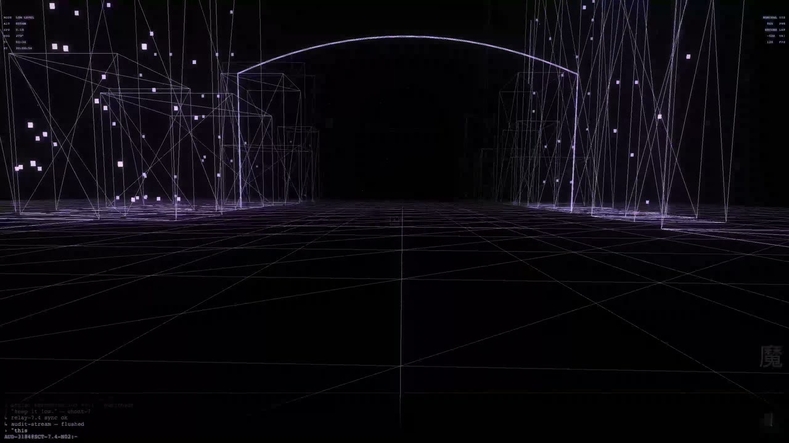<br><sub><b>CITY</b> — banking down a neon-wireframe corridor</sub></td>
  </tr>
  <tr>
    <td>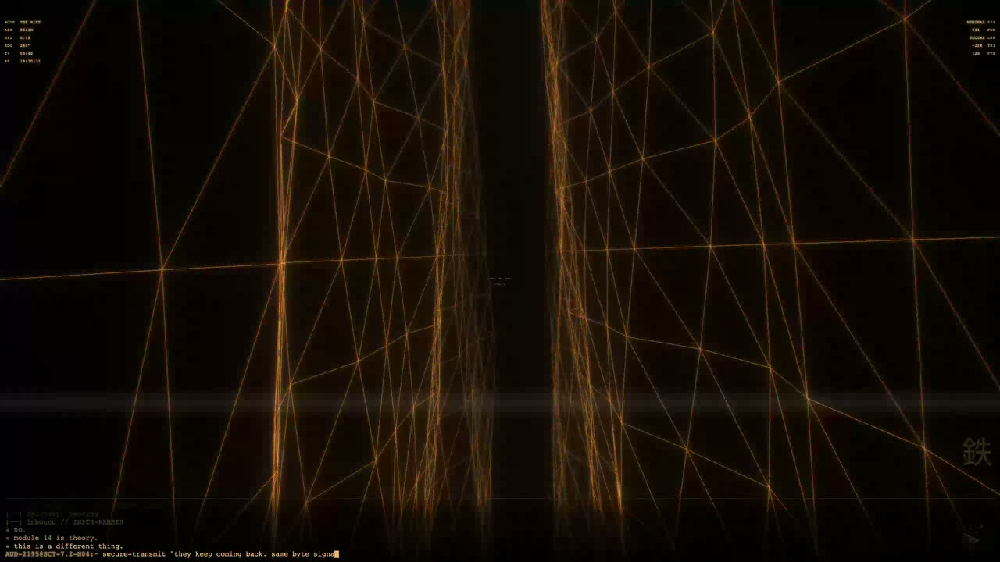<br><sub><b>THE RIFT</b> — barrel-roll dynamics through a fracture</sub></td>
    <td>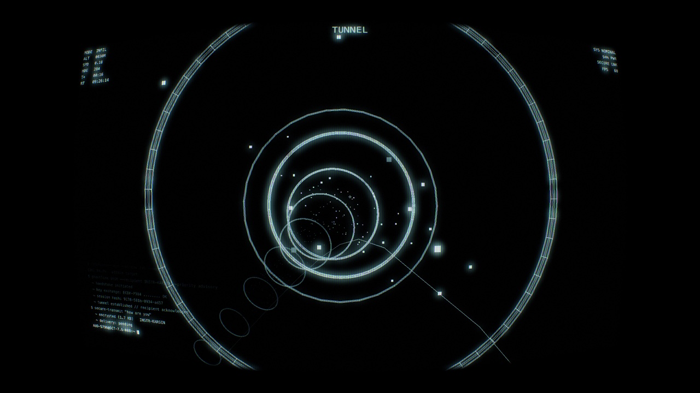<br><sub><b>TUNNEL</b> — banking flight down a Catmull-Rom spine</sub></td>
  </tr>
  <tr>
    <td>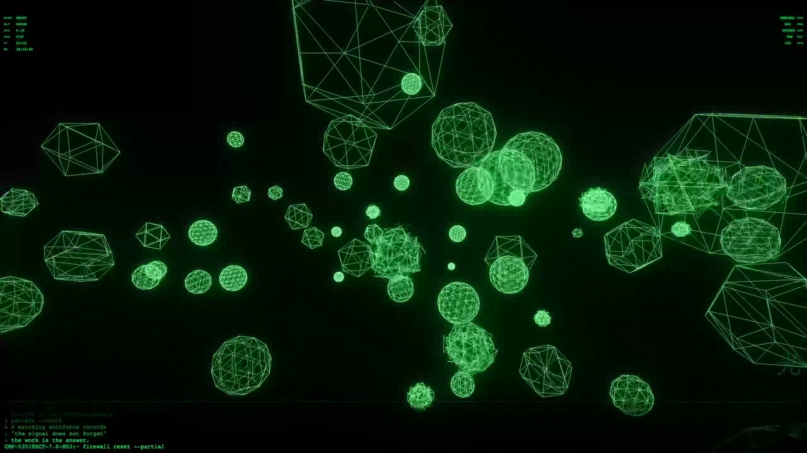<br><sub><b>VOID</b> — flythrough an asteroid belt (depth fade-in)</sub></td>
    <td>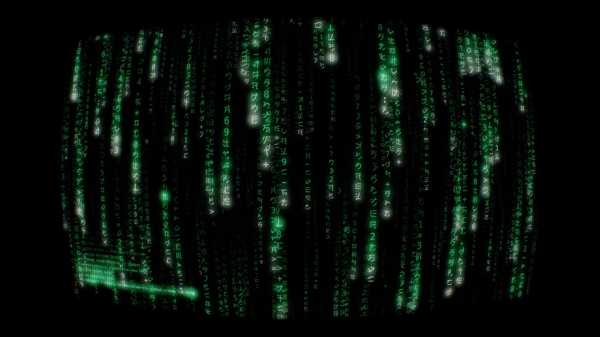<br><sub><b>MATRIX</b> — multi-layer 3D-depth digital rain</sub></td>
  </tr>
</table>

<p align="center">
  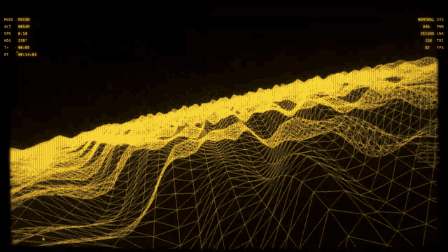<br>
  <sub>Live engine — dynamic banking flight over the terrain (Toxic Haze)</sub>
</p>

<p align="center">
  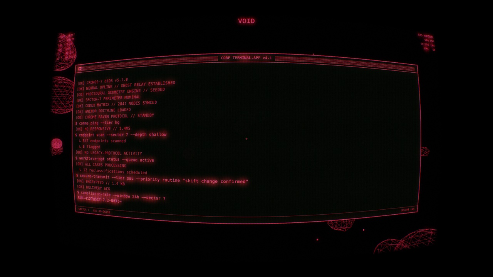<br>
  <sub>The narrative terminal in its <b>Apple-Lisa center-window</b> layout (also available as a bottom strip or full-width band)</sub>
</p>

### 13 phosphor presets

<p align="center">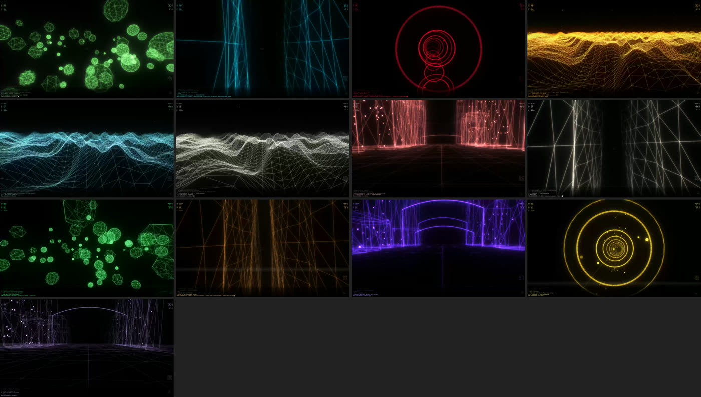</p>

<sub>Kuro · Neural Bleed · Rust Signal · Toxic Haze · Biolink · Ghost Protocol ·
Voidwitch · Circuit · Crimson · Phosphor · Ember · Spectre · Pearl</sub>

---

## The story that never repeats the same way

Each run is a CORP compliance operator's shift, told through the narrative
terminal: `ROUTINE → INTRUSION → ALARM → PANIC → SILENCE`. An encrypted
"ghostlink" backchannel to a former instructor (**INSTR-KARSEN**) answers in
koans — growing guarded, then silent, as things worsen; HQ turns automated and
hollow; the operator drafts, hesitates, and deletes. Every shift differs (role ×
trait × HQ tier × which exchanges fire). When the shift ends the system
**crashes** — a choreographed CRT collapse to a power-off line, black, then an
unstable reboot into a fresh shift with a new persona.

<p align="center">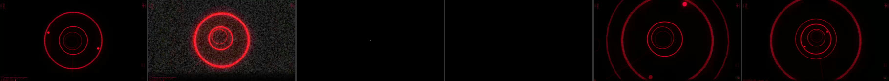</p>

<sub>Signal failure → glitch storm → power-off collapse → dead screen → reboot →
new shift. In the pre-rendered video screensaver this black moment is also the
seamless loop point — the loop is diegetic, not a hidden crossfade.</sub>

---

## Download

### macOS — native app · **notarized** (recommended)

The live Metal screensaver as a standalone app — full procedural variation,
every CRT effect, the whole narrative.

**[↓ KuroScreensaver-native-app-macos.zip](https://codeberg.org/jkaindl/kuro-screensaver/releases/latest)** → unzip, drag **KuroMetalApp.app** to `/Applications`, open. Turn on **auto-start-on-idle** in its settings to use it as a real screensaver.

> Notarized + stapled with a Developer ID — it opens cleanly, no Gatekeeper
> warning. Requires macOS 14+ (Apple Silicon).

### Windows 11 (`.scr`)

A real `.scr` — since **v0.9.0** a tiny native host (~270 KB zip, no bundled
runtime; the old ~65 MB .NET package is history). WebView2 does the rendering
and is built into Windows 11 (on Windows 10 the host shows a download link if
it's missing).

| Download | Run |
|---|---|
| [↓ KuroScreensaver-Setup.exe](https://codeberg.org/jkaindl/kuro-screensaver/releases/latest) | Easiest: one-click installer, per-user, no admin rights. |
| [↓ KuroScreensaver-windows.zip](https://codeberg.org/jkaindl/kuro-screensaver/releases/latest) | Manual: unzip into a folder you keep, right-click `KuroScreensaver.scr` → **Install**. |

Full steps + troubleshooting: **[docs/WINDOWS-INSTALL.md](docs/WINDOWS-INSTALL.md)**.

Or just play it in a browser: **[jkaindl.codeberg.page/kuro-screensaver](https://jkaindl.codeberg.page/kuro-screensaver/)**.

All versions: **[releases page](https://codeberg.org/jkaindl/kuro-screensaver/releases)**.

> The Windows `.scr` is unsigned, so SmartScreen warns on first run — click
> **"More info" → "Run anyway"** (once). Full notes: [docs/WINDOWS-INSTALL.md](docs/WINDOWS-INSTALL.md).
>
> The old macOS `.saver` builds (pre-rendered video `.saver`s + the legacy WebGL
> `.app`/`.saver`) were **retired in v0.5.0** — the notarized native app above
> replaces them.

---

## What it does

- **Six procedural 3D scenes** — `TERRAIN · CITY · THE RIFT · TUNNEL · VOID` plus
  a static **MATRIX** rain scene. **Dynamic banking flight**: a weaving camera
  that banks into its turns (adjustable strength, always-level start) with
  occasional eased maneuvers; seam-free infinite terrain; a Catmull-Rom tunnel
  spine; barrel rolls in The Rift. Same seed → same run.
- **Narrative terminal** — the full operator's-shift story (INSTR-KARSEN
  ghostlink, HQ escalation drafts, hesitations, last words) driven by a realistic
  typewriter over a phase-modulated script bank, in three layouts: a bottom
  **strip**, a full-width **band**, or an **Apple-Lisa center-window**.
- **Retro-CRT suite** — screen curvature, aperture-grille phosphor mask, phosphor
  persistence trails, bloom + warm halation, NTSC dot-crawl, scanlines + vignette,
  a power-on flash, and a glitch chain (H-sync tear, V-roll, flicker, black
  frames, static) feeding the diegetic crash→reboot. One intensity knob, or
  per-effect sliders.
- **Looks** — one-click vibe presets (*Clean · Heavy CRT · Broken Terminal ·
  Vaporwave · Matrix*) that set every effect at once.
- **HUD overlay** — tactical info panels, crosshair, scene-label slab, real-time
  clock, plus a power-on + BIOS boot sequence.
- **Procedural audio** — a synthetic CRT hum + Carpenter-style soundscape. No
  audio assets.
- **Day/night + weather**, **13 color presets**, scene auto-cycle, and
  auto-start-on-idle (native app).

<sub>Native macOS app: Swift + Metal (shaders compiled at runtime — no Xcode
needed). Web / cross-platform builds: TypeScript + three.js (WebGL2).</sub>

---

## Build

### Native macOS app (Metal — Xcode-free)

```bash
bash scripts/build-native-app.sh       # build + sign → native/macos/build/KuroMetalApp.app
bash scripts/package-native-app.sh     # + notarize + staple → dist-native/ (needs a Developer ID)
bash scripts/run-native-tests.sh       # logic tests (assert-based, headless)
```

The renderer is verified headlessly by rendering frames to PNG
(`scripts/build-native-harness.sh`) — no window or real screensaver activation
needed.

### Web app

```bash
npm install
npm run dev        # Vite dev server → http://localhost:5173
npm run build      # production bundle → dist/
npm run typecheck  # tsc --noEmit (run before committing src/ changes)
```

The web app exits on **Esc**; the native app exits on any input and keeps its
settings (scene, preset, effects, terminal layout, bank strength…) in a config
window with a live preview.

---

## Architecture at a glance

**Native (`native/macos/`)** — a platform-agnostic Metal renderer plus a thin host:

```
native/macos/
├── KuroNativeSaver/Core/   Platform-agnostic engine (Metal):
│   ├── Renderer · Shaders   scene pass → bloom/trails → CRT composite
│   ├── *Scene.swift         terrain · city · rift · tunnel · void · matrix
│   ├── CameraFly            banked weaving flight choreography
│   ├── Terminal · Script    the operator narrative (+ INSTR-KARSEN ghostlink)
│   ├── Hud · TextRenderer · FontAtlas   overlay + runtime CoreText glyph atlas
│   └── MatrixRain · Synth · Palette · …
├── KuroMetalApp/           Standalone macOS app host (CAMetalLayer + CVDisplayLink)
└── harness/                Headless PNG render harness for verification
```

**Web (`src/`)** — the original engine is **plugin-shaped but framework-free**
(it never `import`s from `obsidian`); `host-web/` fulfils the host contract in
the browser, so the same bundle backports into the Obsidian plugin unchanged.

```
src/engine/   controller · engine/scenes · fx/crt-sim · audio/synth · terminal · hud · data
src/host-web/ plugin-shim · persistence (localStorage) · obsidian-dom-polyfill
```

Conventions for contributors and AI assistants are in [`AGENTS.md`](AGENTS.md);
design history is under [`docs/specs/`](docs/specs/).

---

## Compatibility

- **macOS 14+** — the native app (Apple Silicon; Metal). The 60 fps cap
  and adaptive quality keep it smooth on weaker GPUs.
- **Modern browsers** — the web app: Chromium ≥ 90, Firefox ≥ 90, Safari ≥ 14,
  WebGL2 required.

---

## License

[GNU AGPL-3.0](LICENSE) — copyleft with the network-use clause. If you host this
engine (or a fork) so others can use it over a network, the source of your
variant must also be available under the AGPL.
